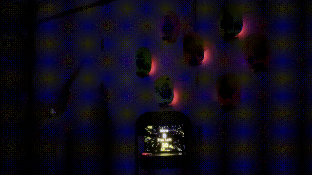
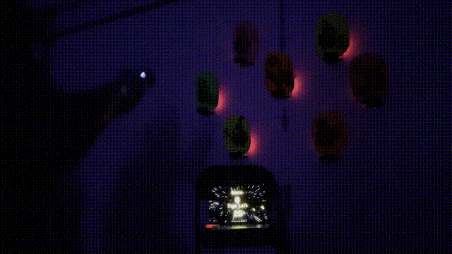
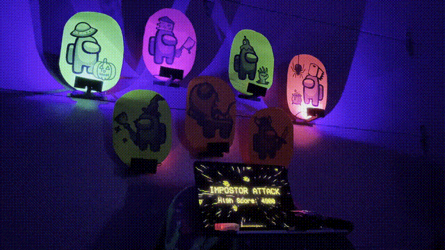

# Imposter Attack 2024

|                  MagiQuest wand input                   |                   Laser tag toy gun input                   |
| :-----------------------------------------------------: | :---------------------------------------------------------: |
|  |  |

This is the code behind Imposter Attack, an infrared shooting gallery game I made for Halloween 2024 that uses battery-powered ESP32 targets and a Node.js-based scoreboard server.

> [!IMPORTANT]
> 👉 Full writeup here: https://blog.langworth.com/imposter-attack 👈

> [!WARNING]
> I didn't plan on open-sourcing this originally, so it's quite a mess and has a bunch of stuff hardcoded. Feel free to send a pull request if you want to clean it up.

## Prerequisites

- Python 3.x
- pyenv (Python version manager)
- Node.js v20 or newer
- Two or more ESP32 devices
- [MicroPython firmware](https://micropython.org/download/ESP32_GENERIC/)

## devtool

This is a tool to copy dependencies and files to a MicroPython board over serial. It wraps `mpremote` in order to watch a directory for changes, automatically copy them to the board, and then monitor the serial port for output.

To install dependencies, run `pip install -r devtool/requirements.txt`.

Then run `devtool.py <directory>`, like `devtool.py target`.

## scoreboard

This is the scoreboard and game server. To run it:

- Make sure an ESP32 device running the `bridge` code is connected to your computer
- Install [pnpm](https://pnpm.io/installation)
- Run `pnpm install`
- Run `pnpm dev`
- Go to `http://localhost:4000/` for the scoreboard and `http://localhost:4000/admin.html` for the admin interface

To add music, download the files into `scoreboard/public/music/game` or `scoreboard/public/music/menu` and add them to the `gameMusicFiles` or `menuMusicFiles` array in `scoreboard/public/scoreboard.js`.

```js
const gameMusicFiles = [
  "among-us-hide-and-seek.mp3",
	...
]

const menuMusicFiles = [
  "pigstep.mp3",
	...
]
```

You'll need to add your own sound effects referenced in `scoreboard.js` since I don't have the license to distribute the ones I used. They're referenced like this:

```js
const startSound = new Howl({ src: ["/sfx/round-start.mp3"] });
const endSound = new Howl({ src: ["/sfx/victory-crew.mp3"] });
const bossAppearSound = new Howl({ src: ["/sfx/impostor-roar.mp3"] });
const bossDeathSound = new Howl({ src: ["/sfx/boss-death.mp3"] });
```

## target

This is the code that runs on the ESP32 devices, which communicate with the bridge, which communicates with the scoreboard. Get started [downloading the firmware](https://micropython.org/download/ESP32_GENERIC/) and modifying `01_flash.sh` with the path to the firmware. Then run `01_flash.sh` to flash the MicroPython firmware to the ESP32, then run `02_install.sh` to install the code and dependencies.

When iterating quickly, it's easiest to keep the ESP32 plugged in use `devtool.py` to watch the `target` directory for changes and automatically copy files to the ESP32.

In the field when devices aren't connected, I use [uOTA](https://github.com/mkomon/uota) to update the firmware over the wifi network. The devices don't connect to the wifi network until requested to update. This requires running a simple HTTP server (I run `npx http-server -p 4444` in the `webroot` directory) and then running `03_update.sh` to build a tarball and trigger the update. The devices will connect to the wifi network and update themselves.

Make sure to update the `target/main.py` file with the correct WiFi credentials:

```python
WIFI_SSID = "mywifi"
WIFI_PASSWORD = "sekrit"
```

You'll also want to update `target/uota.cfg` with your IP address or where you're serving the `webroot` directory:

```json
{
  "url": "http://192.168.0.123:4444",
	...
}
```

## bridge

This is a simple bridge that receives messages from the ESP-NOW network and sends them to the serial port. It also receives messages from the serial port and sends them to the ESP-NOW network. This is how the targets communicate with scoreboard. All devices speak JSON.

You can use the `01_flash.sh` command to flash the MicroPython firmware to the ESP32. Then you can use the standard `mpremote` command to copy `main.py` to the board, or use my own `devtool.py` command if you want to make frequent changes.

## Music Tracks

I used [yt-dlp](https://github.com/yt-dlp/yt-dlp) to download the music from YouTube and [sox](https://sox.sourceforge.net/) to convert the Opus files to MP3 (but you could also use [ffmpeg](https://ffmpeg.org/)). Put these in `scoreboard/public/music/game` or `scoreboard/public/music/menu` and add them to the `gameMusicFiles` or `menuMusicFiles` array in `scoreboard/public/scoreboard.js`.

### Game Music

- [Among Us Hide and Seek](https://www.youtube.com/watch?v=0bnSKWV4t8E)
- [Cyberpunk 2077 - Rebel Path](https://www.youtube.com/watch?v=AGsjA1pXajk)
- [DOOM - At Doom's Gate](https://www.youtube.com/watch?v=BSsfjHCFosw)
- [Hotline Miami - Hydrogen](https://www.youtube.com/watch?v=SNE2oCZH_4k)
- [Jetpack Joyride - Main Theme](https://www.youtube.com/watch?v=MiUjLJJligs)
- [Jetpack Joyride - Bad as Hog](https://www.youtube.com/watch?v=ER8GWCPvvCU)
- [Jetpack Joyride - Gravity](https://www.youtube.com/watch?v=KUUPG3jqS8o)
- [Crypt of the NecroDancer - Cold Sweat](https://www.youtube.com/watch?v=_-NcLHvn2I0&list=PLhFC8pd7oZvwJYhjmpZVyaKG7CUNoVvae&index=16)
- [Crypt of the NecroDancer - Deep Sea Bass](https://www.youtube.com/watch?v=Sr1naG_GSAs&list=PLhFC8pd7oZvwJYhjmpZVyaKG7CUNoVvae&index=22)
- [Crypt of the NecroDancer - Disco Descent](https://www.youtube.com/watch?v=fvyXOXbi8kE&list=PLhFC8pd7oZvwJYhjmpZVyaKG7CUNoVvae&index=4)
- [Crypt of the NecroDancer - Heart of the Crypt](https://www.youtube.com/watch?v=nTYiuhX6kf0&list=PLhFC8pd7oZvwJYhjmpZVyaKG7CUNoVvae&index=20)
- [Crypt of the NecroDancer - Hot Mess](https://www.youtube.com/watch?v=40kBkxknDGk&list=PLhFC8pd7oZvwJYhjmpZVyaKG7CUNoVvae&index=17)
- [Crypt of the NecroDancer - Igneous Rock](https://www.youtube.com/watch?v=Wvnb42Lp4AY&list=PLhFC8pd7oZvwJYhjmpZVyaKG7CUNoVvae&index=13)
- [Crypt of the NecroDancer - Knell](https://www.youtube.com/watch?v=ftyE2w1CUFs&list=PLhFC8pd7oZvwJYhjmpZVyaKG7CUNoVvae&index=23)
- [Crypt of the NecroDancer - Konga Conga Kappa](https://www.youtube.com/watch?v=WUAq7-YpO0w&list=PLhFC8pd7oZvwJYhjmpZVyaKG7CUNoVvae&index=7)
- [Crypt of the NecroDancer - Last Dance](https://www.youtube.com/watch?v=_yBqlPVmfX0&list=PLhFC8pd7oZvwJYhjmpZVyaKG7CUNoVvae&index=25)
- [Crypt of the NecroDancer - Mausoleum Mash](https://www.youtube.com/watch?v=PH-fHEZWxWc&list=PLhFC8pd7oZvwJYhjmpZVyaKG7CUNoVvae&index=6)
- [Crypt of the NecroDancer - Metalmancy](https://www.youtube.com/watch?v=C8sSkxgmueA&list=PLhFC8pd7oZvwJYhjmpZVyaKG7CUNoVvae&index=11)
- [Crypt of the NecroDancer - Momentum Mori](https://www.youtube.com/watch?v=nZiorkb9F1M&list=PLhFC8pd7oZvwJYhjmpZVyaKG7CUNoVvae&index=24)
- [Crypt of the NecroDancer - Stone Cold](https://www.youtube.com/watch?v=MJ-yuVymMLw&list=PLhFC8pd7oZvwJYhjmpZVyaKG7CUNoVvae&index=12)
- [Crypt of the NecroDancer - Wight to Remain](https://www.youtube.com/watch?v=am05YeWW-Mo&list=PLhFC8pd7oZvwJYhjmpZVyaKG7CUNoVvae&index=21)
- [Streets of Rage 2 - Alien Power](https://www.youtube.com/watch?v=_xC8PnEUmwY&list=PLB7F9A5456C337B43&index=10)
- [Streets of Rage 2 - Dreamer](https://www.youtube.com/watch?v=Xlb8UYuSIp8&list=PLB7F9A5456C337B43&index=9)
- [Streets of Rage 2 - Go Straight](https://www.youtube.com/watch?v=E5g-QHq925o&list=PLB7F9A5456C337B43&index=1)
- [Streets of Rage 2 - Mad Max](https://www.youtube.com/watch?v=i-lc624eNwY&list=PLB7F9A5456C337B43&index=19)
- [Streets of Rage 2 - Under Logic](https://www.youtube.com/watch?v=SauvTwBDpto&list=PLB7F9A5456C337B43&index=11)

### Menu Music

- [Breath of the Wild - Field (Day)](https://www.youtube.com/watch?v=xGi23M_5lXg)
- [Breath of the Wild - Hinox Battle](https://www.youtube.com/watch?v=jv487XpKudE)
- [Breath of the Wild - Parasail Theme](https://www.youtube.com/watch?v=5vwWFYy9UA0)
- [Breath of the Wild - Shrine Theme](https://www.youtube.com/watch?v=4IakZtHzBL8)
- [Breath of the Wild - Stone Talus Battle](https://www.youtube.com/watch?v=z2vaSlpliEs)
- [Chrono Trigger - Main Theme](https://www.youtube.com/watch?v=-1LDIPBWjtU)
- [DOOM - Dark Halls](https://www.youtube.com/watch?v=gKHOiTE_2sM)
- [DOOM - Suspense](https://www.youtube.com/watch?v=FMex4f8cwEY)
- [GoldenEye 007 - Pause Theme](https://www.youtube.com/watch?v=A7lLHJ6yfH0)
- [Halo - Main Theme](https://www.youtube.com/watch?v=0jXTBAGv9ZQ)
- [Hotline Miami - Crystals](https://www.youtube.com/watch?v=AVblOqZBlJw)
- [Hotline Miami - Horse Steppin'](https://www.youtube.com/watch?v=wa3qqfgp1Ns)
- [Hotline Miami - Miami](https://www.youtube.com/watch?v=IKuA-m_6eOo&list=PLLKwfUfqCCODZUCwMBeMlv182Fy187gmA&index=6)
- [Hotline Miami - Miami 2](https://www.youtube.com/watch?v=eFHtlECedPA&list=PLLKwfUfqCCODZUCwMBeMlv182Fy187gmA&index=7)
- [Jetpack Joyride - Colossatron Theme](https://www.youtube.com/watch?v=YGENC5W77tw&list=PLrcFQHDS0yh34RuuXvEktAEBBFrcIWFFG&index=13)
- [Jetpack Joyride - Home Base](https://www.youtube.com/watch?v=Cu3cbjfq4B0&list=PLrcFQHDS0yh34RuuXvEktAEBBFrcIWFFG&index=1)
- [Jetpack Joyride - The Stash](https://www.youtube.com/watch?v=RUNDA23MGHA&list=PLrcFQHDS0yh34RuuXvEktAEBBFrcIWFFG&index=6)
- [Minecraft - Subwoofer Lullaby](https://www.youtube.com/watch?v=Gpd85y_iTxY)
- [Crypt of the NecroDancer - Fungal Funk](https://www.youtube.com/watch?v=d-rvJ3ygqiU&list=PLhFC8pd7oZvwJYhjmpZVyaKG7CUNoVvae&index=8)
- [Crypt of the NecroDancer - Tombtorial](https://www.youtube.com/watch?v=1ZU6F0srCl0&list=PLhFC8pd7oZvwJYhjmpZVyaKG7CUNoVvae&index=1)
- [Minecraft - Pigstep](https://www.youtube.com/watch?v=R9eC3WBRKeY)
- [Streets of Rage 2 - Slow Moon](https://www.youtube.com/watch?v=Xeloqt4Wkcw&list=PLB7F9A5456C337B43&index=13)
- [Tears of the Kingdom - Korok Forest (Day)](https://www.youtube.com/watch?v=h7otsWhLC80)
- [Tears of the Kingdom - Title Theme](https://www.youtube.com/watch?v=fcLKaNLN5Xg)

## Credits

- [Howler.js](https://howlerjs.com) (included as minified)
- [`starfield.gif`](https://giphy.com/gifs/starfield-pico8-l3vRnoppYtfEbemBO) is from Giphy
- `astronaut.png` and all likenessness to Among Us characters are from [Innersloth](https://www.innersloth.com/games/among-us/)
- [VCR OSD Mono](https://www.dafont.com/vcr-osd-mono.font) font is from DaFont
- [micropython_ir](https://github.com/peterhinch/micropython_ir)
- [uOTA](https://github.com/mkomon/uota)
- [Halloween Icon Pack](https://www.iconfinder.com/iconsets/halloween-01) is from Josy Dom Alexis on Iconfinder

## License

Unless otherwise specified, all code is MIT licensed.

---


